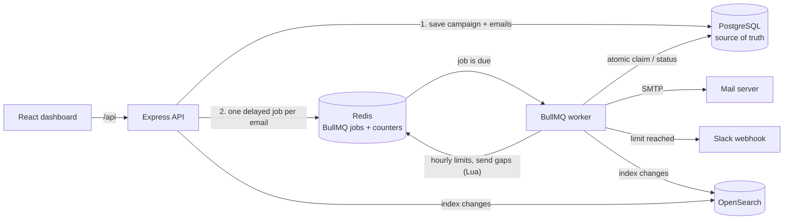

# MailPilot – Fault-Tolerant Email Campaign Scheduler

MailPilot is a full-stack email campaign scheduler. You sign in with Google, upload a list of leads, write an email and choose when it goes out, how far apart the emails are and how many can go out per hour. Every email is stored in **PostgreSQL** and scheduled as its own **BullMQ delayed job on Redis**, with no cron. A separate worker sends each email on time through SMTP and enforces per-sender and per-campaign hourly limits with atomic Redis counters. When a limit is reached, emails are rescheduled instead of dropped, and the user gets a Slack alert. The system survives crashes and restarts without losing or double-sending an email.

**Live demo:** [LIVE_DEMO_URL]
> The backend runs on a free hosting tier, so the first request after it has been idle can take 1–2 minutes.

**Stack:** TypeScript · Express 5 · BullMQ · Redis · PostgreSQL (Prisma) · OpenSearch · React 19 · Tailwind CSS · TanStack Query

---

## Features

- **Scheduled campaigns:** CSV/TXT lead upload (duplicates removed), rich-text body, attachments, start time, delay between emails and hourly limit.
- **No cron:** every email is a BullMQ delayed job whose delay is the time until it should be sent.
- **Crash-safe delivery:** a startup reconciler plus an atomic database claim mean no lost and no duplicate sends after restarts.
- **Rate limiting across workers:** per-sender *and* per-campaign hourly limits in Redis (atomic Lua scripts), and a minimum gap between sends from the same sender.
- **Overflow rescheduling:** when an hourly limit is reached, emails move into later hours in their original order. Nothing is dropped.
- **Slack alerts:** each user connects Slack through real OAuth and gets one alert per sender/campaign per hour when a limit is hit.
- **Full-text search:** OpenSearch with search-as-you-type, falling back to Postgres when the cluster is unavailable.
- **Google sign-in** with an httpOnly session cookie.
- **Live queue dashboard:** Bull Board at `/api/admin/queues` (login required).
- **Dashboard:** Scheduled and Sent tabs with live counts, email detail page, starring, filters and a mobile-responsive layout.

## Tech stack

| Layer | Technologies |
|---|---|
| **Frontend** | React 19, Vite, TypeScript, Tailwind CSS 4, TanStack Query, React Router, TipTap (rich-text editor) |
| **Backend** | Node.js, TypeScript, Express 5, BullMQ, Zod (request + env validation), Nodemailer, Pino, Helmet, Vitest |
| **Data** | PostgreSQL via Prisma 7 (source of truth), Redis (jobs, rate-limit counters), OpenSearch (search index) |
| **Infra / integrations** | Docker Compose (local Postgres, Redis, OpenSearch), Render (API + worker), Vercel (frontend), Google OAuth, Slack OAuth, Ethereal SMTP (test mail server), Bull Board |

---

## How it works



**1. Scheduling with delayed jobs, not cron.** `POST /api/campaigns` validates the request, de-duplicates recipients, sanitizes the HTML and plans a send time for every email up front ([`schedulePlanner.ts`](backend/src/services/schedulePlanner.ts)). Emails are spaced by the campaign delay, and no clock hour gets more than the campaign's hourly limit. The campaign and all its emails are saved in one transaction, then one BullMQ job per email is added with `delay = scheduledAt − now` and `jobId = email id`. The codebase has no cron, polling loop or `setInterval` for scheduling.

**2. PostgreSQL is the source of truth.** Every email row tracks its status (`SCHEDULED → SENDING → SENT / FAILED`), scheduled time, attempts and deferrals. Redis only holds the timers and counters, and OpenSearch is a rebuildable index.

**3. No lost or duplicate sends after restarts.**
- **Startup reconciler** ([`reconciler.ts`](backend/src/queue/reconciler.ts)): every time a worker starts, it re-queues every email still `SCHEDULED` in Postgres, plus any `SENDING` email whose lock is stale. Because the job id is the email id, BullMQ ignores emails that already have a job, so the reconciler is safe to run any number of times. Overdue emails go out immediately and future ones keep their time. This covers a crash between the DB commit and the enqueue, a worker dying mid-send, and even a wiped Redis.
- **Atomic DB claim** ([`emailWorker.ts`](backend/src/workers/emailWorker.ts)): before sending, the worker flips the row from `SCHEDULED` to `SENDING` with a single conditional `UPDATE`. Only one worker can win, and `SENT`/`FAILED` rows never match. A claim older than 2 minutes is treated as abandoned and can be taken over.
- **No double scheduling:** BullMQ ignores duplicate job ids, the DB enforces a unique `(campaignId, recipient)` pair, and the Compose form sends an idempotency key so a double-clicked *Send* creates one campaign.
- SMTP errors are retried by BullMQ (3 attempts, exponential backoff from 30 s), after which the email is marked `FAILED` with the error.

**4. Hourly limits across many workers.** Counters are Redis keys per sender/campaign and UTC hour (e.g. `rl:sender:{id}:2026100214`). One **Lua script** checks *both* the sender and the campaign limit and increments both only if both have room, so any number of workers can run in parallel without overshooting ([`rateLimiter.ts`](backend/src/services/rateLimiter.ts)). A second Lua script gives each sender a "next free send time" (based on the Redis clock), which enforces `MIN_DELAY_BETWEEN_SENDS_MS` between sends from the same sender across processes.

**5. Overflow rescheduling.** When a limit is hit, the email goes back to `SCHEDULED` with a new time and its job is moved there. Overflow is spread across as many future hours as needed, in original order, instead of everything piling into the next hour. A fast path checks the counters before touching the database, so a large overflow costs one DB write per email.

**6. Slack alerts.** Users connect Slack through the OAuth v2 flow with the `incoming-webhook` scope, and the webhook is stored per user. When a limit is hit, a Redis `SET NX` key ensures one alert per user, limit and hour, however many emails or workers hit it. The connection is looked up when an alert is sent, so connecting takes effect without a restart. Alerts are skipped silently when Slack is not connected.

**7. Search.** Email changes are batched into OpenSearch bulk writes. Each document is versioned with the row's `updatedAt`, so an older snapshot never overwrites a newer one. Recipient and subject use `search_as_you_type` fields. Without a search cluster, search falls back to a Postgres query, and `npm run search:reindex` rebuilds the index from Postgres.

**8. Auth and monitoring.** Google OAuth (ID token verified with `google-auth-library`) issues a signed JWT in an httpOnly cookie. Bull Board shows waiting, delayed, active, completed and failed jobs live at `/api/admin/queues`.

---

## Reliability testing

**Unit tests (Vitest):** run with `npm test`. They cover the send-time planner (delay spacing, hourly windows, 1,000 emails never exceeding the limit in any hour), overflow spreading across later hours in order, Redis hour keys, and the per-sender FIFO mutex.

**Load test** ([`loadTest.ts`](backend/src/scripts/loadTest.ts)): schedules N emails "at the same moment" through the real HTTP API, prints live progress, then checks these guarantees against the database:

| Check | How it is verified |
|---|---|
| Nothing dropped | every row is SCHEDULED, SENDING, SENT or FAILED |
| No email sent twice | number of SENT rows = number of distinct Message-IDs |
| Hourly limit respected | busiest (sender, UTC hour) ≤ that sender's limit |
| Gap between sends | minimum gap per sender ≥ `MIN_DELAY_BETWEEN_SENDS_MS` |
| No permanent failures | 0 FAILED rows |

**Crash test:** in a recorded run, I scheduled 1,000 emails across 3 senders with the limit lowered to 10/hour/sender, hard-killed the worker mid-run and restarted it. The reconciler re-queued all pending emails, every check above passed (no duplicates across the crash, no sender above 10 sends in an hour, ≥ 2 s between sends), and Slack received one alert per sender instead of one per email. To reproduce it, start the worker with a low limit, run the load test, kill the worker process (the script doesn't kill it for you), restart it and re-check:

```bash
MAX_EMAILS_PER_HOUR_PER_SENDER=10 npm run dev:worker    # terminal 1 (Bash syntax)
npm run load-test --workspace backend -- --count 1000   # terminal 2; kill + restart terminal 1 mid-run
npm run load-test --workspace backend -- --verify <campaignId>
```

**Known edge case:** if a process dies in the instant *after* the SMTP server accepts an email but *before* the DB records `SENT`, that email can be sent once more after its 2-minute lock expires. SMTP has no transactional send, so every email has a fixed `Message-ID` that receivers can use to de-duplicate.

---

## Local setup

### Prerequisites
- **Node.js ≥ 20.19** and npm
- **PostgreSQL**, **Redis** and (optionally) **OpenSearch**. The included `docker-compose.yml` runs all three:
  ```bash
  docker compose up -d
  ```
- A **Google OAuth client** (for login) and optionally a **Slack app** (for alerts). See [OAuth setup](#oauth-setup) below.

### 1. Install and configure
```bash
npm install                                    # installs both workspaces and generates the Prisma client
cp backend/.env.example backend/.env           # defaults match docker-compose; add your OAuth credentials
```
The frontend needs no `.env` file (see [`frontend/.env.example`](frontend/.env.example)).

### 2. Database
```bash
npm run db:deploy --workspace backend          # apply Prisma migrations
npm run seed:senders --workspace backend       # create 3 Ethereal test SMTP senders
```
[Ethereal](https://ethereal.email) is a fake SMTP service: it accepts mail but never delivers it. Each sent email gets a preview link shown in the dashboard.

### 3. Run
```bash
npm run dev:api        # Express API on http://localhost:4000
npm run dev:worker     # BullMQ worker (separate process, so it can be killed/scaled on its own)
npm run dev:web        # Vite frontend on http://localhost:5173 (proxies /api to :4000)
# or all three at once:
npm run dev
```
Open http://localhost:5173 and sign in with Google.

### 4. Test and build
```bash
npm test               # backend unit tests (Vitest)
npm run typecheck      # type-check backend and frontend
npm run build          # production build of both apps
npm start              # run the built API (npm run start:worker for the worker)
```

### OAuth setup

<details>
<summary><b>Google OAuth (login)</b></summary>

1. Google Cloud Console → **Google Auth Platform** → configure the consent screen (External).
2. **Clients → Create client → Web application**
   - Authorized JavaScript origin: `http://localhost:5173`
   - Authorized redirect URI: `http://localhost:5173/api/auth/google/callback`
3. Put the client ID and secret into `GOOGLE_CLIENT_ID` / `GOOGLE_CLIENT_SECRET` in `backend/.env`.
4. While the app is in *Testing* mode, add your account under **Audience → Test users**.
</details>

<details>
<summary><b>Slack app (rate-limit alerts, optional)</b></summary>

1. <https://api.slack.com/apps> → **Create New App → From a manifest** → paste:
   ```json
   {
     "display_information": { "name": "MailPilot Alerts" },
     "features": { "bot_user": { "display_name": "MailPilot Alerts", "always_online": false } },
     "oauth_config": {
       "redirect_urls": ["http://localhost:5173/api/slack/callback"],
       "scopes": { "bot": ["incoming-webhook"] }
     },
     "settings": { "org_deploy_enabled": false, "socket_mode_enabled": false, "token_rotation_enabled": false }
   }
   ```
2. **Basic Information → App Credentials** → copy the client ID and secret into `SLACK_CLIENT_ID` / `SLACK_CLIENT_SECRET`.
3. Connect from the dashboard (**user menu → Connect Slack**), which runs the OAuth flow.
</details>

---

## Project structure

```
.
├── backend/
│   ├── prisma/            # schema and migrations
│   └── src/
│       ├── config/        # validated environment config
│       ├── lib/           # Prisma, Redis, OpenSearch, logger, JWT helpers
│       ├── middleware/    # auth, error handling
│       ├── queue/         # BullMQ queue + startup reconciler
│       ├── routes/        # auth, campaigns, emails, senders, slack, health, queue dashboard
│       ├── schemas/       # Zod request schemas
│       ├── scripts/       # seed senders, reindex search, load test
│       ├── services/      # planner, rate limiter, mailer, campaigns, search, Slack
│       ├── workers/       # email job processor
│       ├── server.ts      # API process
│       └── worker.ts      # worker process
├── frontend/
│   └── src/
│       ├── api/           # API client
│       ├── components/    # reusable UI + layout
│       ├── features/      # auth, compose, emails, slack
│       ├── pages/         # Login, Mailbox, Email detail, Compose
│       └── types/         # typed API models
├── docs/screenshots/
├── docker-compose.yml     # local Postgres, Redis, OpenSearch
└── render.yaml            # Render deployment blueprint
```

---

## Screenshots

| Mailbox (Scheduled / Sent) | Compose |
|---|---|
|  |  |

| Slack alert | Bull Board queue dashboard |
|---|---|
|  |  |

---

## Why I built this

Cold-email tools live or die on two things: sending each email at exactly the right time, and never going over a sender's hourly limit, because overshooting gets a mailbox flagged. Both have to keep working when a worker crashes or a server restarts. Most simple schedulers run a cron job that polls the database, which is imprecise and easy to break under concurrency. I wanted to build a scheduler that gets this right without cron, using delayed jobs, a database as the source of truth, and atomic Redis counters shared by every worker.

## Future improvements

- **Open and click tracking:** tracking pixel and redirect links, with per-campaign engagement stats.
- **Multi-tenant workspaces:** teams with roles, workspace-owned senders, and an admin-only Bull Board.
- **Observability:** Prometheus metrics (queue depth, send latency, deferrals, failures) with a Grafana dashboard and alerting.
- **Production delivery:** a real provider (e.g. Amazon SES) with bounce/complaint webhooks, sender warm-up, and attachments in object storage instead of Postgres.

---

## Author

**Navneet Singh**
- GitHub: [GITHUB_PROFILE_URL]
- LinkedIn: [LINKEDIN_PROFILE_URL]
