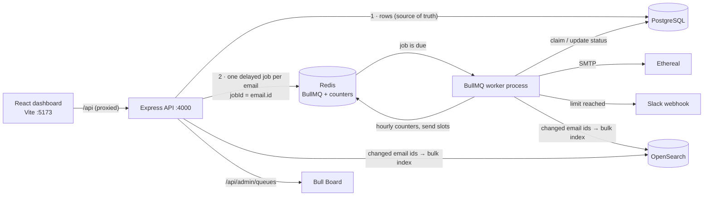

# ReachInbox — Full-stack Email Job Scheduler

A production-style email scheduler: an Express + BullMQ backend that schedules, rate-limits and sends emails through Ethereal SMTP, and a React dashboard (built to the Figma) to compose campaigns and track scheduled / sent emails.

**Demo video:** _add link here_

| | |
|---|---|
| **Backend** | TypeScript, Express 5, BullMQ 6 on Redis, PostgreSQL via Prisma 7, Nodemailer → Ethereal, OpenSearch (Elasticsearch API), Bull Board, Slack OAuth |
| **Frontend** | React 19, Vite, TypeScript, Tailwind CSS 4, TanStack Query, TipTap editor |
| **Scheduling** | BullMQ delayed jobs only — **no cron** anywhere |

---

## Contents
1. [Quick start](#1-quick-start)
2. [Configuration](#2-configuration)
3. [Architecture](#3-architecture)
4. [How scheduling works](#4-how-scheduling-works)
5. [Persistence, restarts and idempotency](#5-persistence-restarts-and-idempotency)
6. [Rate limiting, delay and concurrency](#6-rate-limiting-delay-and-concurrency)
7. [Behaviour under load (1000+ emails)](#7-behaviour-under-load-1000-emails)
8. [Slack alerts](#8-slack-alerts)
9. [Search and the queue dashboard](#9-search-and-the-queue-dashboard)
10. [Frontend](#10-frontend)
11. [Features → requirements](#11-features--requirements)
12. [API](#12-api)
13. [Testing](#13-testing)
14. [Assumptions, shortcuts and trade-offs](#14-assumptions-shortcuts-and-trade-offs)
15. [Project structure](#15-project-structure)

---

## 1. Quick start

**Prerequisites:** Node.js 20+ and npm 10+. Either Docker (for local Postgres / Redis / OpenSearch) or hosted equivalents. Development was done against hosted **Neon** (Postgres), **Redis Cloud** and **Bonsai** (OpenSearch).

```bash
# 1. Install (also generates the Prisma client)
npm install

# 2. Infrastructure — either hosted services, or locally:
docker compose up -d

# 3. Configure
cp backend/.env.example backend/.env
#    fill in the values (see "Configuration"); Docker values are in the comments

# 4. Create the database schema
npm run db:deploy --workspace backend

# 5. Create Ethereal sender accounts (idempotent; default 3)
npm run seed:senders --workspace backend

# 6. Run API + worker + web together
npm run dev
```

Open **http://localhost:5173** and log in with Google.

`npm run dev` starts three processes (colour-coded in one terminal):

| Process | Command | Port | Purpose |
|---|---|---|---|
| `api` | `npm run dev:api` | 4000 | Express REST API, OAuth, Bull Board |
| `worker` | `npm run dev:worker` | — | BullMQ worker that sends email |
| `web` | `npm run dev:web` | 5173 | Vite dev server; proxies `/api` to :4000 |

The API and the worker are **separate processes** on purpose: the worker can be restarted, crashed or scaled independently (the restart demo stops and starts it on its own).

> The `docker-compose.yml` is provided for convenience. I developed and tested against the hosted services listed above and did not have Docker available to run the compose file myself.

### External accounts

<details>
<summary><b>Ethereal (fake SMTP)</b> — nothing to sign up for</summary>

`npm run seed:senders` calls Ethereal's API to create test SMTP accounts and stores them in the `Sender` table. It prints each account's login so you can open the mailbox at <https://ethereal.email/login>. Every sent email also stores an Ethereal **preview link**, shown as *View on Ethereal* on the email detail page.

`npm run seed:senders --workspace backend -- 5` tops up to 5 senders. Senders are round-robined across a campaign unless one is picked in the **From** dropdown.
</details>

<details>
<summary><b>Google OAuth</b> (login)</summary>

1. Google Cloud Console → **Google Auth Platform** → configure the consent screen (External), and add your account under **Audience → Test users**.
2. **Clients → Create client → Web application**
   - Authorized JavaScript origin: `http://localhost:5173`
   - Authorized redirect URI: `http://localhost:5173/api/auth/google/callback`
3. Put the client ID and secret into `GOOGLE_CLIENT_ID` / `GOOGLE_CLIENT_SECRET`.
</details>

<details>
<summary><b>Slack app</b> (rate-limit alerts)</summary>

1. <https://api.slack.com/apps> → **Create New App → From a manifest**, pick a workspace, paste:
   ```json
   {
     "display_information": { "name": "ReachInbox Alerts" },
     "features": { "bot_user": { "display_name": "ReachInbox Alerts", "always_online": false } },
     "oauth_config": {
       "redirect_urls": ["http://localhost:5173/api/slack/callback"],
       "scopes": { "bot": ["incoming-webhook"] }
     },
     "settings": { "org_deploy_enabled": false, "socket_mode_enabled": false, "token_rotation_enabled": false }
   }
   ```
2. **Basic Information → App Credentials** → copy the client ID and secret into `SLACK_CLIENT_ID` / `SLACK_CLIENT_SECRET`.
3. Do **not** click "Install to Workspace" in Slack: users install it from the dashboard (**user menu → Connect Slack**), which runs the real OAuth flow.
</details>

---

## 2. Configuration

All configuration is in `backend/.env` and validated at startup with Zod (the process exits with a clear message if anything is missing or malformed). See [`backend/.env.example`](backend/.env.example).

| Variable | Default | Description |
|---|---|---|
| `DATABASE_URL` / `DIRECT_URL` | — | Postgres (pooled for the app, direct for migrations) |
| `REDIS_URL` | — | Redis for BullMQ and rate-limit counters. **Must not evict keys** |
| `ELASTICSEARCH_URL` | _(empty)_ | OpenSearch/Elasticsearch URL. Optional — search falls back to Postgres |
| `JWT_SECRET` | — | Signs the session cookie and the Slack OAuth `state` |
| `GOOGLE_CLIENT_ID` / `_SECRET` / `_CALLBACK_URL` | — | Google login |
| `SLACK_CLIENT_ID` / `_SECRET` / `SLACK_REDIRECT_URI` | — | Slack install flow |
| `WORKER_CONCURRENCY` | `5` | Jobs processed in parallel per worker process |
| `MIN_DELAY_BETWEEN_SENDS_MS` | `2000` | Minimum gap between two sends **from the same sender** |
| `MAX_EMAILS_PER_HOUR_PER_SENDER` | `200` | Hourly cap per sender (a `Sender.hourlyLimit` row value overrides it) |

Per-campaign settings (delay between emails, hourly limit, start time) come from the compose form.

---

## 3. Architecture



**Postgres is the source of truth** for every email and its status. **Redis holds the timers** (BullMQ delayed jobs) and the rate-limit counters. **OpenSearch** is a derived search index that can always be rebuilt from Postgres.

### Data model (Prisma)

| Table | Purpose |
|---|---|
| `User` | Google account (name, email, avatar) |
| `Sender` | Ethereal SMTP identity; optional per-sender `hourlyLimit` |
| `Campaign` | One "Compose → Send" submission: subject, body, start time, delay, hourly limit, optional fixed sender, `idempotencyKey` |
| `Email` | One row per recipient = one BullMQ job. `status` (`SCHEDULED → SENDING → SENT/FAILED`), `scheduledAt`, `deferrals`, `attempts`, `lockedAt`, `messageId`, `previewUrl`, `completedAt`. Unique `(campaignId, recipient)` |
| `Attachment` | Up to 3 files (≤ 2 MB each) per campaign |
| `SlackIntegration` | Per-user webhook from the Slack OAuth install |

---

## 4. How scheduling works

1. **Compose → `POST /api/campaigns`.** The request is validated (Zod), recipients are lower-cased and de-duplicated, and the HTML body is sanitized.
2. **Send times are planned up front** ([`schedulePlanner.ts`](backend/src/services/schedulePlanner.ts)): starting at the chosen start time, consecutive emails are `delay` seconds apart, and at most `hourlyLimit` emails fall into any clock hour — overflow starts at the next hour, keeping order. So the Scheduled tab shows realistic times, not "everything at 10:00".
3. **One transaction** inserts the campaign and all email rows (chunked `createMany`). Email ids are generated by the app so they can double as job ids.
4. **One delayed BullMQ job per email** is added (`addBulk`, chunks of 500) with `jobId = email.id` and `delay = scheduledAt − now`.
5. When a job becomes due, the **worker** sends it (sections 5 and 6), records `SENT` + Ethereal preview URL, or retries (3 attempts, exponential backoff from 30 s) and finally records `FAILED` with the error.

There is no cron, polling loop or `setInterval` anywhere: every future action is a BullMQ delayed job.

---

## 5. Persistence, restarts and idempotency

**Requirement:** after a restart, future emails still send at the right time, and nothing is re-sent or restarted from scratch.

| Layer | How |
|---|---|
| **Timers survive restarts** | Jobs live in Redis, not in process memory. Stopping the API or worker loses nothing; on start the worker picks up exactly where it left off. Redis should run with persistence (`appendonly yes`, as in `docker-compose.yml`) and `noeviction`. |
| **Startup reconciler** ([`reconciler.ts`](backend/src/queue/reconciler.ts)) | Every worker start re-enqueues all `SCHEDULED` rows (and `SENDING` rows whose lock went stale). Because `jobId = email.id`, existing jobs are untouched, so this is safe to run any number of times. It covers a crash between "rows committed" and "jobs added", a worker dying mid-send, and even a Redis wipe. Overdue emails go out immediately; future ones keep their time. |
| **No double sends — atomic claim** | Before sending, the worker runs a single `UPDATE … SET status='SENDING' WHERE id=? AND status='SCHEDULED' AND scheduledAt <= now` ([`emailWorker.ts`](backend/src/workers/emailWorker.ts)). Only one worker can win; `SENT`/`FAILED` rows never match. A duplicate or rogue job for an already-sent email is skipped. |
| **No double scheduling** | `jobId = email.id` (BullMQ ignores duplicates), unique `(campaignId, recipient)`, and a per-form `idempotencyKey` so a double-clicked **Send** creates one campaign. |
| **Crash mid-send** | The claim stores `lockedAt`. If a worker dies, BullMQ's stalled-job check hands the job to another worker, which waits until the lock is 2 minutes old before taking over. |

**Verified:** worker killed before emails were due → emails stayed `SCHEDULED` → on restart the reconciler found them and each was sent **exactly once**. Also verified with the worker hard-killed in the middle of a 1000-email run (section 7).

**Known window (at-least-once):** if the process dies *after* the SMTP server accepted a message but *before* the `SENT` update commits, that one email can be sent again after the lock expires. This is inherent to SMTP (no transactional "send"). It is mitigated by a deterministic `Message-ID: <email.id@reachinbox.scheduler>`, so receiving systems can de-duplicate it.

---

## 6. Rate limiting, delay and concurrency

### Hourly limits (Redis, safe across workers)
Two limits are enforced on every send ([`rateLimiter.ts`](backend/src/services/rateLimiter.ts)):

- **Per sender** — `MAX_EMAILS_PER_HOUR_PER_SENDER` (or the sender's own override)
- **Per campaign** — the hourly limit set in the compose form

Counters are Redis keys per UTC clock hour, e.g. `rl:sender:{senderId}:2026100214`. One **Lua script** checks both limits and increments both counters atomically, so any number of worker processes can run concurrently without overshooting — nothing relies on in-memory counts.

### When the limit is reached
Jobs are **never dropped or failed**. The email goes back to `SCHEDULED` with a new `scheduledAt` (visible in the dashboard, marked ↻) and its job is moved to that time:

- The *n*-th email deferred out of an hour goes to hour `next + ⌊n / limit⌋`, slot `n mod limit` × gap. Deferred emails are therefore **spread over as many future hours as they need, in their original order** — instead of piling into the next hour and being deferred again every hour.
- **Fast path:** jobs carry `senderId` / `campaignId` / `userId`. If Redis shows the hour is already full, the worker reschedules with a single DB update, without claiming or loading the email. This made rescheduling a 1000-email overflow ~4× faster (≈15 emails/s against a remote DB).
- A deferral is not counted as a send attempt.

### Minimum delay between sends
- **Per campaign:** "Delay between 2 emails" from the compose form is built into the planned `scheduledAt` times.
- **Per sender (provider throttling):** **`MIN_DELAY_BETWEEN_SENDS_MS` (default 2 s)**. Each sender has a Redis "next free send time"; a worker reserves a slot and waits for it. Inside a worker process a sender's sends also run one at a time (FIFO), with one SMTP connection per sender, and the gap is measured from the **end** of the previous send. Measured result: ~3 s between consecutive sends from a sender (2 s gap + SMTP time).

**Why not BullMQ's built-in `limiter`?** It throttles job *pickup* for the whole queue. Under a burst, jobs that are only being rescheduled would each consume a limiter slot (1000 deferrals × 2 s = 33 minutes of wasted capacity), and it can't express "per sender". The custom slot only throttles real SMTP sends, and different senders send in parallel.

### Concurrency
`WORKER_CONCURRENCY` jobs run in parallel per worker, and more worker processes can be added. Safety under parallelism comes from the atomic DB claim, the atomic Lua counters, the Redis send slots, and BullMQ's own job locks (renewed automatically while a job waits for its send slot, so waiting never looks like a stall).

---

## 7. Behaviour under load (1000+ emails)

`npm run load-test --workspace backend -- --count 1000` schedules N emails through the real HTTP API, watches progress, then checks the guarantees against the database (`--verify <id>` / `--cleanup <id>` later).

What happens with 1000 emails due at the same moment:

1. The API validates, plans, inserts 1000 rows in one transaction and adds 1000 delayed jobs — about 6 s end-to-end against remote Neon/Redis.
2. Senders are round-robined, so each sender's hourly budget is used.
3. Each sender sends up to its hourly limit, ≥ `MIN_DELAY_BETWEEN_SENDS_MS` apart.
4. Everything else is rescheduled into later hours in order (fast path), one Slack alert per sender.

**Measured run** — 1000 emails, 3 senders, `MAX_EMAILS_PER_HOUR_PER_SENDER=10`, worker **hard-killed mid-run** and restarted:

| Check | Result |
|---|---|
| Every email accounted for (nothing dropped) | ✅ 1000 = scheduled + sending + sent, 0 failed |
| No email sent twice (across the crash) | ✅ sent rows = distinct Message-IDs |
| Hourly limit per sender | ✅ 10 / 10 / 9 (a slot used by an in-flight email at the crash is not reused — conservative) |
| Gap between sends per sender | ✅ min 2.93 s / 2.97 s / 2.99 s |
| Deferred spread | ✅ exactly 30 per hour (3 × 10) over the following 27 hours |
| Restart | ✅ new worker's reconciler re-enqueued the 978 pending emails |
| Slack | ✅ 3 alerts (one per sender), not 970 |

---

## 8. Slack alerts

- **Connect:** user menu → **Connect Slack** → `GET /api/slack/connect` → Slack OAuth consent (pick a channel) → `GET /api/slack/callback` exchanges the code (`oauth.v2.access`) and stores the incoming-webhook URL **per user**. A confirmation message is posted immediately.
- The OAuth `state` is a signed 10-minute JWT carrying the user id (CSRF protection, and the callback does not depend on the session cookie).
- **Alert:** the moment an email is deferred by an hourly limit, the worker posts a Block Kit message (sender, limit, campaign, resume time) to the owner's Slack. Redis `SET NX` makes it **once per user, limit and hour**, however many jobs or workers hit it.
- **Not connected → silently skipped**, never an error. The connection is read at send time, so connecting later starts alerts immediately — no restart or redeploy.
- **Disconnect** removes the webhook and revokes the token. If Slack reports the webhook is gone (app removed on Slack's side), the stale connection is dropped automatically.
- **Send test alert** in the user menu posts a test message.

---

## 9. Search and the queue dashboard

### Search (Elasticsearch API via OpenSearch)
- Index `reachinbox-emails`: recipient and subject as `search_as_you_type` (prefix matching while typing), body text, plus status / user / dates for filtering.
- **Indexing** ([`searchIndexer.ts`](backend/src/services/searchIndexer.ts)): API and worker only mark email ids as changed. Every ~1 s the indexer reloads those rows from Postgres and writes one bulk request. Each document is versioned with the row's `updatedAt` (`version_type: external_gte`), so an older snapshot can never overwrite a newer one, and deleted rows are removed. One request in flight at a time.
- **Querying:** OpenSearch ranks matching ids; rows are then loaded from Postgres so statuses are always current. Every query is filtered by user.
- **Resilience:** if the cluster is down or not configured, search falls back to a Postgres `ILIKE` query (the response says which engine answered). `npm run search:reindex --workspace backend -- --fresh` rebuilds the index from Postgres.

### Live BullMQ dashboard (Bull Board)
**http://localhost:5173/api/admin/queues** (also in the user menu as *Queue dashboard*). Requires login. Shows waiting / delayed / active / completed / failed jobs live, and the details of each job.

---

## 10. Frontend

Built to the Figma: login, sidebar layout, Scheduled / Sent lists, email detail, full-page compose with a Send Later picker.

- **Login** — Google OAuth (real). The email/password form from the Figma is shown, but only Google login is enabled.
- **Header / sidebar** — avatar, name and email; menu with Slack connect / test / disconnect, queue dashboard, **Logout**. Live counts for Scheduled and Sent.
- **Scheduled / Sent** — email, subject + preview, scheduled time (orange badge) or sent time, status badge (`Sent` / `Failed` / `Sending`), star, ↻ for emails moved by the hourly limit. Search, filter (all / starred / failed), refresh, infinite scroll, auto-refresh while emails are moving. Loading skeleton, empty states, error state with retry.
- **Email detail** — sender, recipient, date, rendered body, attachments, status line with *View on Ethereal* or the failure reason.
- **Compose** — From (one sender or round-robin all), recipients as chips (type, paste a list, or **Upload List** for CSV/TXT, which shows how many addresses were detected and removes duplicates), subject, delay between emails, hourly limit, rich-text body (TipTap), up to 3 attachments, **Send Later** (date-time picker + presets) or **Send** now. Inline validation and toasts.

**Code organisation:** `components/ui` (Button, IconButton, Popover/MenuItem, Avatar, Spinner, EmptyState), `components/layout`, `features/*` (each with its own API hooks and components), `pages/*`, and typed API models in `types/api.ts`. Data fetching uses TanStack Query; the compose page (and the editor) is lazy-loaded.

---

## 11. Features → requirements

### Backend
| Requirement | Implementation |
|---|---|
| Accept scheduling requests via API | `POST /api/campaigns` (Zod-validated) |
| Store in a relational DB | PostgreSQL via Prisma; one row per email |
| Schedule with BullMQ delayed jobs, no cron | One delayed job per email, `jobId = email.id` |
| Multiple senders via Ethereal | `Sender` table seeded with Ethereal accounts; round-robin or fixed |
| Searchable via Elasticsearch | OpenSearch index, `GET /api/emails/search`, versioned bulk indexing |
| Live BullMQ dashboard | Bull Board at `/api/admin/queues` |
| Survive restarts, no duplicates | Redis-persisted jobs, startup reconciler, atomic DB claim, idempotency keys |
| Configurable worker concurrency | `WORKER_CONCURRENCY` |
| Minimum delay between sends | `MIN_DELAY_BETWEEN_SENDS_MS` per sender (Redis slot), plus per-campaign delay |
| Emails-per-hour limit, configurable, multi-worker safe | Per sender (`MAX_EMAILS_PER_HOUR_PER_SENDER`) and per campaign; atomic Lua over Redis counters |
| Limit reached → delay, don't drop, keep order | Rescheduled into later hours, spread in order |
| Slack notification on limit (real OAuth, live) | Per-user OAuth install, Block Kit alert, once per hour, safe when not connected |
| Behaviour under 1000+ emails | Section 7 + `npm run load-test` |

### Frontend
| Requirement | Implementation |
|---|---|
| Real Google login, redirect to dashboard | Backend OAuth flow → httpOnly session cookie → `/scheduled` |
| Header with name, email, avatar, logout | Sidebar user card + menu |
| Scheduled / Sent tabs, Compose button | Sidebar navigation with live counts |
| Compose: subject, body, CSV upload with count, start time, delay, hourly limit | Compose page (count shown under the To field) |
| Scheduled table: email, subject, time, status + loading/empty | Mailbox list |
| Sent table: email, subject, sent time, sent/failed + loading/empty | Mailbox list |
| Reusable components, DRY, TypeScript types, loading/empty/error UX | See section 10 |

---

## 12. API

All endpoints except auth callbacks and health require the session cookie.

| Method | Path | Description |
|---|---|---|
| `GET` | `/api/auth/google` → `/callback` | Google OAuth login |
| `GET` | `/api/auth/me` | Current user (+ Slack status) |
| `POST` | `/api/auth/logout` | Clear session |
| `GET` | `/api/senders` | Sender list for the From dropdown |
| `POST` | `/api/campaigns` | Schedule emails `{ subject, bodyHtml, recipients[], startAt?, delayBetweenSeconds, hourlyLimit, senderId?, idempotencyKey?, attachments[] }` |
| `GET` | `/api/emails?status=scheduled\|sent&filter=all\|starred\|failed&page&limit` | Paginated list |
| `GET` | `/api/emails/counts` | Sidebar counts |
| `GET` | `/api/emails/search?q=&tab=&filter=` | Full-text search |
| `GET` | `/api/emails/:id` | Email detail |
| `GET` | `/api/emails/:id/attachments/:attachmentId` | Attachment download |
| `PATCH` | `/api/emails/:id/star` | Star / unstar |
| `GET` | `/api/slack/connect` → `/callback` | Slack OAuth install |
| `DELETE` | `/api/slack` | Disconnect Slack |
| `POST` | `/api/slack/test` | Send a test alert |
| `GET` | `/api/admin/queues` | Bull Board |
| `GET` | `/api/health` | Health (Redis ping) |

Example:
```bash
curl -X POST http://localhost:4000/api/campaigns \
  -H 'Content-Type: application/json' -b 'rb_session=<cookie>' \
  -d '{"subject":"Hello","bodyHtml":"<p>Hi!</p>","recipients":["a@example.com","b@example.com"],
       "startAt":"2026-10-03T10:00:00Z","delayBetweenSeconds":5,"hourlyLimit":100}'
```

---

## 13. Testing

```bash
npm test --workspace backend                         # unit tests (Vitest)
npm run typecheck                                    # both apps
npm run load-test --workspace backend -- --count 1000 --watch 120
```

- **Unit tests:** schedule planning (delay, hourly windows, 1000 emails never exceed the limit in any clock hour), deferral spreading, per-sender FIFO mutex, hour keys.
- **Load test:** see section 7. Tip: start the worker with a small `MAX_EMAILS_PER_HOUR_PER_SENDER` (e.g. 10) to watch limits, deferral and the Slack alert within a minute.
- **Restart test:** schedule emails a couple of minutes ahead → stop the worker (Ctrl+C, or kill it) → wait past the due time → start it again. The worker log shows `reconciled pending emails`, then each email is sent once; the Sent tab and Bull Board confirm it.

---

## 14. Assumptions, shortcuts and trade-offs

- **OpenSearch instead of Elasticsearch.** The free hosted option (Bonsai) runs OpenSearch, an Elasticsearch-API-compatible fork; indexing and queries use the same API. The official `@elastic/elasticsearch` client refuses non-Elastic servers, so the OpenSearch client is used.
- **Hourly windows are UTC clock hours** (e.g. 14:00–14:59 UTC), shared by the planner, the Redis counters and the deferral logic. With non-whole-hour timezones (e.g. IST) the visible window boundary is at :30 local time.
- **At-least-once around SMTP** — see section 5. A crash in the few milliseconds between SMTP acceptance and the DB update can cause one resend after 2 minutes; deterministic Message-IDs mitigate it.
- **Crash-conservative limits.** An hourly slot reserved by an email whose worker crashed is not given back, so a crash can only make a sender send fewer emails that hour, never more.
- **Senders are shared across users** (Ethereal accounts are global). Hourly limits are per sender; the Slack alert goes to the user whose email was deferred.
- **Bull Board** is protected by login but not by roles — any logged-in user can see the queue. Fine for this assignment; production would add an admin role.
- **Email/password login** from the Figma is displayed but disabled; the assignment requires Google OAuth only.
- **Attachments** are stored in Postgres (≤ 3 × 2 MB per campaign) for simplicity; production would use object storage.
- **Latency.** Development used Neon (US-East) and Ethereal from India, so each email takes a few seconds end-to-end (~250 ms per DB round trip, slow SMTP). Jobs themselves are picked up 1–2 s after they are due.
- **Upstash Redis** is not recommended: BullMQ's blocking commands use up its free request quota quickly. Redis Cloud, Railway, or a local Redis work well.
- `npm audit` reports issues in Prisma CLI dev-only dependencies (`mysql2`, `deepmerge-ts`), not used at runtime. Fixing them means moving to the Prisma 8 release candidate, so Prisma is pinned to stable 7.10.

---

## 15. Project structure

```
backend/
  prisma/                schema.prisma, migrations/
  src/
    server.ts            API process
    worker.ts            worker process (BullMQ worker + startup reconciler)
    app.ts               Express app, routes, Bull Board
    config/env.ts        Zod-validated configuration
    queue/               BullMQ queue + reconciler
    workers/             email job processor
    services/            planner, rate limiter, mailer, campaigns, emails, search, Slack, notifications
    routes/              auth, campaigns, emails, senders, slack, health, queue dashboard
    scripts/             seedSenders, reindexSearch, loadTest
frontend/
  src/
    pages/               Login, Mailbox (scheduled/sent), EmailDetail, Compose
    features/            auth, emails, compose, slack (hooks + components)
    components/          ui/ (reusable), layout/ (sidebar, user menu)
    api/ types/ lib/
docker-compose.yml       optional local Postgres, Redis, OpenSearch
```
