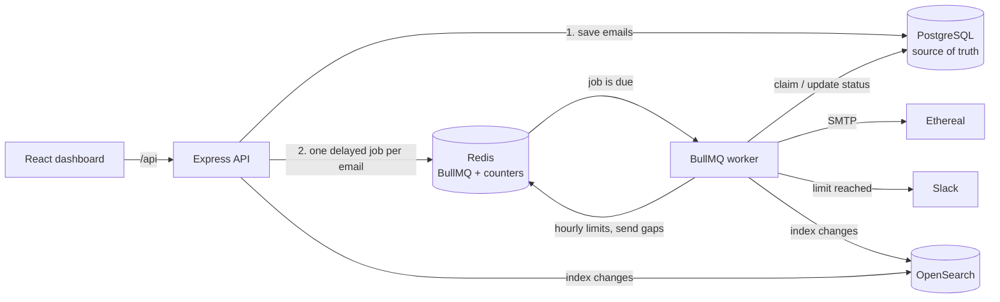
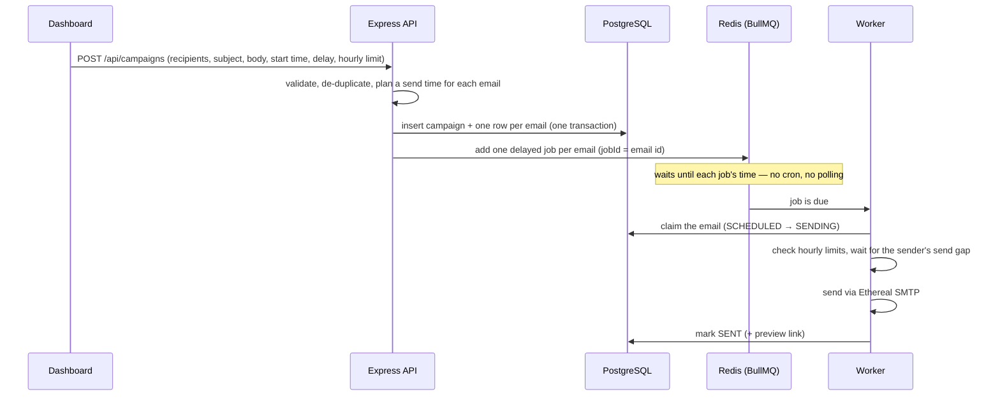

# ReachInbox — Full-stack Email Job Scheduler

A production-style **email scheduler service + dashboard**. You upload a list of leads, write an email, and pick when to send it. The backend stores every email in PostgreSQL, schedules each one as a **BullMQ delayed job on Redis (no cron)**, and a worker sends it through **Ethereal SMTP** at the right time — respecting hourly limits per sender, surviving restarts, and never sending the same email twice.

| | |
|---|---|
| 🎥 **Demo video** | [Watch on Google Drive](https://drive.google.com/file/d/1sAYW6EY8sQaOFTYjJOWWd6VoLbAFSj_d/view?usp=sharing) |
| 🌐 **Live demo** | <https://reachinbox-email-scheduler-tau-two.vercel.app> — the backend runs on Render's free plan, so the first request after it has been idle can take 1–2 minutes |
| 📊 **Live queue dashboard** | `/api/admin/queues` on the live site or locally (requires login) |

**Stack** — Backend: TypeScript · Express 5 · BullMQ 6 · Redis · PostgreSQL (Prisma 7) · Nodemailer → Ethereal · OpenSearch (Elasticsearch API) · Bull Board · Google & Slack OAuth. Frontend: React 19 · Vite · TypeScript · Tailwind CSS 4 · TanStack Query · TipTap.

---

## ✅ Requirements at a glance

| Requirement | Status | Where it's explained |
|---|---|---|
| Schedule emails via API, store in Postgres | ✅ | [Scheduling](#31-how-scheduling-works) |
| BullMQ delayed jobs, **no cron** | ✅ | [Scheduling](#31-how-scheduling-works) |
| Multiple senders via Ethereal SMTP | ✅ | [Ethereal](#21-ethereal-email-fake-smtp) |
| Survives restarts, no lost or duplicate emails | ✅ | [Persistence](#32-how-persistence-on-restart-is-handled) |
| Configurable worker concurrency | ✅ `WORKER_CONCURRENCY` | [Concurrency](#33-how-rate-limiting-and-concurrency-are-implemented) |
| Minimum delay between sends | ✅ **min 2 seconds between sends per sender** | [Rate limiting](#33-how-rate-limiting-and-concurrency-are-implemented) |
| Emails-per-hour limit (Redis-backed, multi-worker safe) | ✅ per sender + per campaign | [Rate limiting](#33-how-rate-limiting-and-concurrency-are-implemented) |
| Limit reached → reschedule, don't drop, keep order | ✅ | [Rate limiting](#33-how-rate-limiting-and-concurrency-are-implemented) |
| Behaviour with 1000+ emails at once | ✅ tested with a mid-run crash | [Under load](#34-behaviour-under-load-1000-emails) |
| Slack alert on limit hit (real OAuth, live message) | ✅ | [Slack](#35-slack-alerts) |
| Searchable via Elasticsearch | ✅ OpenSearch (Elasticsearch API) | [Search](#36-search-and-the-live-queue-dashboard) |
| Live BullMQ dashboard | ✅ Bull Board | [Search](#36-search-and-the-live-queue-dashboard) |
| Google login, dashboard, compose, Scheduled / Sent tables | ✅ built to the Figma, mobile-responsive | [Features](#4-features-implemented) |

---

## Contents

1. [How to run it](#1-how-to-run-it) — backend (Express, Redis, DB, BullMQ worker) and frontend
2. [Ethereal Email and environment variables](#2-ethereal-email-and-environment-variables)
3. [Architecture overview](#3-architecture-overview)
   - [How scheduling works](#31-how-scheduling-works)
   - [How persistence on restart is handled](#32-how-persistence-on-restart-is-handled)
   - [How rate limiting and concurrency are implemented](#33-how-rate-limiting-and-concurrency-are-implemented)
   - [Behaviour under load](#34-behaviour-under-load-1000-emails) · [Slack alerts](#35-slack-alerts) · [Search & queue dashboard](#36-search-and-the-live-queue-dashboard)
4. [Features implemented](#4-features-implemented)
5. [Demo video](#5-demo-video)
6. [Assumptions, shortcuts and trade-offs](#6-assumptions-shortcuts-and-trade-offs)
7. Appendix: [API reference](#a-api-reference) · [Testing](#b-testing) · [Deployment](#c-deployment) · [Project structure](#d-project-structure)

---

## 1. How to run it

### Prerequisites
- **Node.js 20+** and npm 10+
- **PostgreSQL**, **Redis** and (optionally) **OpenSearch/Elasticsearch** — either run them locally with Docker (`docker compose up -d`, see [`docker-compose.yml`](docker-compose.yml)) or use hosted ones. I developed against hosted **Neon** (Postgres), **Redis Cloud** and **Bonsai** (OpenSearch).
- A **Google OAuth client** for login and (optionally) a **Slack app** for alerts — setup steps are in [section 2](#2-ethereal-email-and-environment-variables).

### One-time setup

```bash
npm install                                   # installs both apps (also generates the Prisma client)
cp backend/.env.example backend/.env          # then fill in the values — see section 2
npm run db:deploy --workspace backend         # creates the database tables
npm run seed:senders --workspace backend      # creates 3 Ethereal sender accounts
```

### Run the backend

The backend is **two processes**: the **API** and the **BullMQ worker**. They are separate on purpose, so the worker can be stopped, crashed or scaled on its own (this is what the restart demo does).

```bash
npm run dev:api        # Express API on http://localhost:4000  (REST API, OAuth, Bull Board)
npm run dev:worker     # BullMQ worker: sends emails, enforces limits, recovers after restarts
```

Redis and the database are external services — make sure `REDIS_URL` and `DATABASE_URL` in `backend/.env` point at running instances.

### Run the frontend

```bash
npm run dev:web        # Vite dev server on http://localhost:5173 (proxies /api to :4000)
```

Open **http://localhost:5173** and log in with Google.

> **Shortcut:** `npm run dev` starts the API, worker and frontend together in one terminal.

---

## 2. Ethereal Email and environment variables

### 2.1 Ethereal Email (fake SMTP)

Nothing to sign up for. `npm run seed:senders --workspace backend` calls Ethereal's API, creates **3 test SMTP accounts** and saves them as **senders** in the database. It prints each account's login, so you can open its mailbox at <https://ethereal.email/login>.

- Ethereal **accepts emails but never delivers them** to real inboxes — that is the point of a fake SMTP server.
- Every sent email stores its Ethereal **preview link**, shown as **"View on Ethereal"** on the email's page in the dashboard.
- Emails in a campaign are **round-robined across all senders** (spreading the hourly limits), unless one sender is picked in the **From** dropdown.
- Need more senders? `npm run seed:senders --workspace backend -- 5` tops up to 5.

### 2.2 Environment variables

All configuration lives in **`backend/.env`** (template: [`backend/.env.example`](backend/.env.example)). It is validated at startup — the process stops with a clear message if anything is missing or malformed.

| Variable | Required | Default | What it does |
|---|---|---|---|
| `DATABASE_URL` | ✅ | — | PostgreSQL connection used by the app |
| `DIRECT_URL` | for migrations | — | Direct (non-pooled) Postgres connection used by `prisma migrate` |
| `REDIS_URL` | ✅ | — | Redis for BullMQ jobs and rate-limit counters. Must not evict keys (`maxmemory-policy noeviction`) |
| `JWT_SECRET` | ✅ | — | Signs the login cookie and the Slack OAuth `state` |
| `FRONTEND_URL` | | `http://localhost:5173` | Where users land after login |
| `GOOGLE_CLIENT_ID` / `GOOGLE_CLIENT_SECRET` | ✅ for login | — | Google OAuth client |
| `GOOGLE_CALLBACK_URL` | ✅ for login | — | `http://localhost:5173/api/auth/google/callback` |
| `SLACK_CLIENT_ID` / `SLACK_CLIENT_SECRET` | for alerts | — | Slack app credentials |
| `SLACK_REDIRECT_URI` | for alerts | — | `http://localhost:5173/api/slack/callback` |
| `ELASTICSEARCH_URL` | optional | — | OpenSearch/Elasticsearch URL. If empty, search falls back to Postgres |
| `WORKER_CONCURRENCY` | | `5` | How many jobs one worker processes in parallel |
| `MIN_DELAY_BETWEEN_SENDS_MS` | | `2000` | **Minimum gap between two sends from the same sender** |
| `MAX_EMAILS_PER_HOUR_PER_SENDER` | | `200` | Hourly cap per sender |
| `RUN_WORKER_IN_API` | | `false` | Run the worker inside the API process (for single-service hosting) |

Per-campaign settings — **start time, delay between emails, hourly limit** — are set in the Compose form.

<details>
<summary><b>Setting up Google OAuth</b> (login)</summary>

1. Google Cloud Console → **Google Auth Platform** → configure the consent screen (External).
2. **Clients → Create client → Web application**
   - Authorized JavaScript origin: `http://localhost:5173`
   - Authorized redirect URI: `http://localhost:5173/api/auth/google/callback`
3. Copy the client ID and secret into `GOOGLE_CLIENT_ID` / `GOOGLE_CLIENT_SECRET`.
4. While the app is in *Testing* mode, add your Google account under **Audience → Test users** (or publish the app).
</details>

<details>
<summary><b>Setting up the Slack app</b> (rate-limit alerts)</summary>

1. <https://api.slack.com/apps> → **Create New App → From a manifest** → pick a workspace → paste:
   ```json
   {
     "display_information": { "name": "ReachInbox Alerts" },
     "features": { "bot_user": { "display_name": "ReachInbox Alerts", "always_online": false } },
     "oauth_config": {
       "redirect_urls": ["http://localhost:5173/api/slack/callback"],
       "scopes": { "bot": ["incoming-webhook"] }
     },
     "settings": { "org_deploy_enabled": false, "socket_mode_enabled": false, "token_rotation_enabled": false }
   }
   ```
2. **Basic Information → App Credentials** → copy the client ID and secret into `SLACK_CLIENT_ID` / `SLACK_CLIENT_SECRET`.
3. Don't click "Install to Workspace" in Slack — users connect from the dashboard (**user menu → Connect Slack**), which runs the real OAuth flow.
</details>

---

## 3. Architecture overview



**Three stores, three jobs:**
- **PostgreSQL is the source of truth** — every email and its status (`SCHEDULED → SENDING → SENT / FAILED`).
- **Redis holds the timers** (BullMQ delayed jobs) and the **rate-limit counters**.
- **OpenSearch is a search index** built from Postgres; it can always be rebuilt.

<details>
<summary><b>Data model</b></summary>

| Table | Purpose |
|---|---|
| `User` | Google account (name, email, avatar) |
| `Sender` | An Ethereal SMTP identity; optional per-sender `hourlyLimit` |
| `Campaign` | One Compose → Send: subject, body, start time, delay, hourly limit, optional fixed sender, `idempotencyKey` |
| `Email` | One row per recipient = one BullMQ job. Status, `scheduledAt`, `deferrals`, `attempts`, `lockedAt`, `messageId`, `previewUrl`, `completedAt`. Unique `(campaignId, recipient)` |
| `Attachment` | Up to 3 files (≤ 2 MB each) per campaign |
| `SlackIntegration` | Per-user Slack webhook from the OAuth install |
</details>

### 3.1 How scheduling works

**In one sentence:** every email becomes its own BullMQ **delayed job**, whose delay is the time until it should be sent.



1. **Validate.** The request is checked, recipients are lower-cased and de-duplicated, and the HTML body is sanitized.
2. **Plan send times up front** ([`schedulePlanner.ts`](backend/src/services/schedulePlanner.ts)). From the start time, emails are spaced by the campaign's **delay**, and no clock hour gets more than the campaign's **hourly limit** — extra emails start in the next hour, in order. So the Scheduled tab shows real times, not "everything at 10:00".
3. **Save** the campaign and all email rows in **one transaction**.
4. **Queue** one delayed job per email (`delay = scheduledAt − now`). The job id **is** the email id.
5. **Send** when due ([`emailWorker.ts`](backend/src/workers/emailWorker.ts)). On SMTP errors the job retries (3 attempts, exponential backoff from 30 s) and finally records `FAILED` with the error.

There is **no cron, polling loop or `setInterval`** anywhere — every future action is a BullMQ delayed job.

### 3.2 How persistence on restart is handled

**Goal:** after a restart, future emails still send at the right time, and nothing is re-sent or started from scratch.

| Protection | How it works |
|---|---|
| **Timers survive restarts** | Jobs are stored in **Redis**, not in the process's memory. Stopping the API or worker loses nothing — when the worker starts again it continues from where it was. (Redis should run with persistence: `appendonly yes`.) |
| **Startup recovery** | Each time the worker starts, a **reconciler** ([`reconciler.ts`](backend/src/queue/reconciler.ts)) re-queues every email still `SCHEDULED` in Postgres. Because the job id is the email id, emails that already have a job are skipped — it is safe to run any number of times. It covers a crash between "saved to DB" and "added to queue", a worker dying mid-send, and even a wiped Redis. **Overdue emails go out immediately; future ones keep their time.** |
| **Never sent twice** | Before sending, the worker **claims** the email with one atomic SQL update: `SCHEDULED → SENDING`. Only one worker can win; `SENT` or `FAILED` emails can never be claimed again. A duplicate job for an already-sent email is simply skipped. |
| **Never scheduled twice** | BullMQ ignores a second job with the same id, the database rejects the same recipient twice in one campaign, and the Compose form sends an **idempotency key**, so a double-clicked *Send* creates one campaign. |
| **Worker crashes mid-send** | The claim records `lockedAt`. If the worker dies, BullMQ hands the job to another worker, which waits until the lock is 2 minutes old before taking over. |

**Verified:** stopped the backend before emails were due → waited past their time → started it again → the reconciler found them and each was sent **exactly once**. Also verified with the worker **hard-killed in the middle of a 1000-email run** ([section 3.4](#34-behaviour-under-load-1000-emails)).

### 3.3 How rate limiting and concurrency are implemented

#### Delay between emails — **min 2 seconds between sends per sender**
Two separate delays:
- **Per campaign:** the *"Delay between 2 emails"* field in Compose is built into each email's planned send time.
- **Per sender (provider throttling):** `MIN_DELAY_BETWEEN_SENDS_MS` = **2000 ms**. Each sender has a "next free send time" in Redis; a worker reserves the next slot and waits for it. Within a worker, one sender's sends run one at a time over a single SMTP connection, and the 2 s gap is counted from the **end** of the previous send. Measured: ~3 s between consecutive sends from a sender (2 s gap + SMTP time).

#### Emails per hour — per sender **and** per campaign
- **Per sender:** `MAX_EMAILS_PER_HOUR_PER_SENDER` (default 200; a sender can override it).
- **Per campaign:** the *Hourly Limit* field in Compose.

Both are **Redis counters keyed by sender/campaign + UTC hour**, e.g. `rl:sender:{senderId}:2026100214`. A single **Lua script** checks both limits and increments both counters in one atomic step ([`rateLimiter.ts`](backend/src/services/rateLimiter.ts)), so **any number of workers or servers** can run at once without going over the limit. Nothing relies on in-memory counts.

#### When the hourly limit is reached
Emails are **never dropped or failed** — they are **rescheduled into later hours, in their original order**:
- The email goes back to `SCHEDULED` with a new send time (shown in the dashboard with a ↻ marker), and its BullMQ job is moved to that time.
- Overflow is **spread across as many future hours as needed** — e.g. with a limit of 10/hour, the 25th extra email goes to the 3rd hour — instead of every extra email piling into the next hour and being rescheduled again and again.
- A **fast path** checks the Redis counters before touching the database, so rescheduling a big overflow costs one DB update per email (~15 emails/second against a remote database).
- The user gets **one Slack alert** per sender per hour ([section 3.5](#35-slack-alerts)).

#### Concurrency
- `WORKER_CONCURRENCY` (default **5**) jobs run in parallel per worker, and you can run several worker processes.
- Parallel jobs stay safe because of the **atomic database claim**, the **atomic Redis counters**, the **per-sender send slots** in Redis, and BullMQ's own job locks.

<details>
<summary><b>Why not BullMQ's built-in <code>limiter</code>?</b></summary>

BullMQ's limiter throttles job *pickup* for the whole queue. During a burst, every job that is only being **rescheduled** would still use up a limiter slot — 1000 reschedules × 2 s ≈ 33 minutes of wasted capacity — and it can't express "per sender". The custom Redis slot only throttles **real SMTP sends**, and different senders send in parallel.
</details>

### 3.4 Behaviour under load (1000+ emails)

What happens when **1000 emails are scheduled for the same moment**:
1. The API validates and plans them, saves 1000 rows in one transaction and adds 1000 delayed jobs (~6 s against remote Neon/Redis).
2. Emails are spread across the senders, so each sender's hourly budget is used.
3. Each sender sends up to its hourly limit, at least 2 s apart.
4. The rest are rescheduled into later hours in order, and Slack gets one alert per sender.

**Measured run** — 1000 emails, 3 senders, limit lowered to 10/hour/sender, worker **hard-killed mid-run** and restarted:

| Check | Result |
|---|---|
| Nothing dropped | ✅ all 1000 accounted for, 0 failed |
| No email sent twice (across the crash) | ✅ sent rows = distinct Message-IDs |
| Hourly limit respected | ✅ 10 / 10 / 9 per sender |
| Gap between sends | ✅ ≥ 2.9 s for every sender |
| Overflow spread in order | ✅ exactly 30 per hour (3 × 10) over the next 27 hours |
| Recovery after the crash | ✅ the restarted worker re-queued all 978 pending emails |
| Slack | ✅ 3 alerts (one per sender), not 970 |

Reproduce it: `npm run load-test --workspace backend -- --count 1000` ([Testing](#b-testing)).

### 3.5 Slack alerts

- **Connect:** user menu → **Connect Slack** → Slack's real OAuth consent screen (pick a channel) → the backend exchanges the code and stores the webhook **for that user**. A confirmation message is posted right away.
- **Alert:** the moment a sender's hourly limit is reached, the worker posts a message to the user's Slack: sender, limit, campaign and when sending resumes. It is sent **once per user, limit and hour**, however many emails or workers hit the limit.
- **Not connected:** alerts are simply skipped — no error, no crash.
- **Connect later:** the connection is read each time an alert is sent, so alerts start immediately — **no restart or redeploy**.
- **Disconnect** removes the webhook and revokes the token. **Send test alert** (user menu) posts a test message.

### 3.6 Search and the live queue dashboard

**Search (Elasticsearch API, via OpenSearch)**
- Search by **recipient, subject or body**; matching works while you type (e.g. "lea" finds `lead.one@…`). Each user only ever sees their own emails.
- Changes to emails are indexed in the background in small batches, and every document carries a version, so an older update can never overwrite a newer one.
- If the search cluster is down or not configured, search falls back to a Postgres query. `npm run search:reindex --workspace backend -- --fresh` rebuilds the index from Postgres.

**Live BullMQ dashboard (Bull Board)** — **`/api/admin/queues`** (also in the user menu as *Queue dashboard*). Shows waiting, delayed, active, completed and failed jobs in real time. Requires login.

---

## 4. Features implemented

### Backend
| Area | What's implemented |
|---|---|
| **Scheduler** | `POST /api/campaigns` validates the request, plans each email's send time (delay + hourly limit) and creates **one BullMQ delayed job per email**. No cron. Up to 10,000 recipients per campaign, up to 3 attachments. |
| **Persistence** | Postgres is the source of truth; jobs live in Redis; a **startup reconciler** re-queues anything pending; an **atomic claim** prevents double sends; idempotency keys prevent double scheduling. |
| **Rate limiting** | Per-sender **and** per-campaign hourly limits in **Redis** (atomic Lua, multi-worker safe); overflow **rescheduled into later hours in order**; **min 2 s between sends per sender**; all limits configurable via env / Compose. |
| **Concurrency** | `WORKER_CONCURRENCY` parallel jobs per worker; safe across multiple workers and servers. |
| **Senders** | Multiple Ethereal SMTP senders, round-robin or a fixed sender per campaign. |
| **Slack** | Real OAuth install per user; live alert when a limit is hit; works after connecting without a redeploy. |
| **Search** | OpenSearch (Elasticsearch API) full-text search with Postgres fallback. |
| **Queue dashboard** | Bull Board, live. |
| **Auth** | Google OAuth; httpOnly session cookie. |

### Frontend (built to the Figma, mobile-responsive)
| Area | What's implemented |
|---|---|
| **Login** | Real Google OAuth → redirects to the dashboard. (The Figma's email/password form is shown but disabled — the assignment requires Google.) |
| **Dashboard** | Header/sidebar with **name, email, avatar**, **Logout**, Slack connect/test/disconnect, queue dashboard link; **Scheduled** and **Sent** tabs with live counts; **Compose** button. |
| **Compose** | Subject, rich-text body, **CSV/TXT lead upload with the number of emails detected** (duplicates removed), **start time** (Send Later picker + presets), **delay between emails**, **hourly limit**, sender choice, attachments. Inline validation and toasts. |
| **Scheduled table** | Email, subject, **scheduled time**, status; loading skeleton and empty state. |
| **Sent table** | Email, subject, **sent time**, status (**sent / failed**); loading skeleton and empty state. |
| **Also** | Email detail page with "View on Ethereal", search, filters (all / starred / failed), star, auto-refresh, error states with retry, mobile layout. |
| **Code quality** | Reusable UI components (`Button`, `IconButton`, `Popover`, `Avatar`, `Spinner`, `EmptyState`), feature folders with their own API hooks, typed API models in [`types/api.ts`](frontend/src/types/api.ts), TanStack Query for data fetching, Compose page lazy-loaded (code splitting). |

---

## 5. Demo video

🎥 **[Watch the demo on Google Drive](https://drive.google.com/file/d/1sAYW6EY8sQaOFTYjJOWWd6VoLbAFSj_d/view?usp=sharing)** (under 5 minutes). It shows:

1. **Google login** and the dashboard header.
2. **Connecting Slack** through the real OAuth flow.
3. **Creating scheduled emails** from the frontend: CSV upload, delay, hourly limit, Send Later — then the **Scheduled** tab and Bull Board.
4. The **restart scenario**: stop the server → start it again → the scheduled emails still send, and appear in the **Sent** tab.
5. **Rate limiting under load**: 100 emails at once with a low hourly limit, emails rescheduled to later hours, the Slack alert, and the load test's PASS checks.

---

## 6. Assumptions, shortcuts and trade-offs

- **OpenSearch instead of Elasticsearch.** The free hosted option (Bonsai) runs OpenSearch, which uses the same API for indexing and searching. The official Elastic client refuses non-Elastic servers, so the OpenSearch client is used.
- **Hourly windows are UTC clock hours** (e.g. 14:00–14:59 UTC), used consistently by the planner, the Redis counters and the rescheduling. In a timezone like IST the window boundary appears at :30 local time.
- **"At least once" around SMTP.** If the process dies in the instant *after* the SMTP server accepted an email but *before* the database records `SENT`, that one email can be sent again after 2 minutes. This is inherent to SMTP (there is no transactional send). Each email has a fixed `Message-ID`, so receiving systems can de-duplicate it.
- **Crashes err on the safe side.** An hourly slot used by an email whose worker crashed is not given back, so a crash can make a sender send *fewer* emails that hour, never more.
- **Senders are shared across users** (the Ethereal accounts are global). Limits are per sender; the Slack alert goes to the user whose email was rescheduled.
- **Bull Board** requires login but has no admin role — any logged-in user can view it. Fine for this assignment; production would restrict it.
- **Attachments are stored in Postgres** (max 3 × 2 MB) for simplicity; production would use object storage such as S3.
- **Free hosting:** the live backend runs the worker inside the API process on Render's free plan, which sleeps when idle. Emails that fall due while it sleeps are sent as soon as it wakes (the startup recovery picks them up). A paid plan would run the worker as its own service.
- **Latency:** the hosted database is in the US and Ethereal's servers are slow, so each send takes a few seconds end to end; jobs themselves start within 1–2 s of their due time.
- **Upstash Redis isn't suitable** (BullMQ's constant commands exhaust its free quota); Redis Cloud, Railway or local Redis work well.
- `npm audit` flags issues in **dev-only** dependencies of the Prisma CLI that aren't used at runtime; fixing them would mean a pre-release Prisma, so stable 7.10 is pinned.

---

## Appendix

### A. API reference

All endpoints need the login cookie except the OAuth callbacks and `/api/health`.

| Method | Path | Description |
|---|---|---|
| `GET` | `/api/auth/google` → `/callback` | Google OAuth login |
| `GET` | `/api/auth/me` | Current user + Slack status |
| `POST` | `/api/auth/logout` | Log out |
| `GET` | `/api/senders` | Senders for the From dropdown |
| `POST` | `/api/campaigns` | **Schedule emails** |
| `GET` | `/api/emails?status=scheduled\|sent&filter=all\|starred\|failed&page=&limit=` | Paginated Scheduled / Sent lists |
| `GET` | `/api/emails/counts` | Sidebar counts |
| `GET` | `/api/emails/search?q=&tab=&filter=` | Full-text search |
| `GET` | `/api/emails/:id` | Email detail |
| `GET` | `/api/emails/:id/attachments/:attachmentId` | Download an attachment |
| `PATCH` | `/api/emails/:id/star` | Star / unstar |
| `GET` | `/api/slack/connect` → `/callback` | Slack OAuth install |
| `DELETE` | `/api/slack` | Disconnect Slack |
| `POST` | `/api/slack/test` | Send a test alert |
| `GET` | `/api/admin/queues` | Bull Board |
| `GET` | `/api/health` | Health check |

**Scheduling from Postman / curl.** Log in once in the browser, copy the `rb_session` cookie (DevTools → Application → Cookies), then:

```bash
curl -X POST http://localhost:4000/api/campaigns \
  -H "Content-Type: application/json" \
  -b "rb_session=<your cookie>" \
  -d '{
        "subject": "Hello from the scheduler",
        "bodyHtml": "<p>Hi there!</p>",
        "recipients": ["a@example.com", "b@example.com"],
        "startAt": "2026-10-03T10:00:00Z",
        "delayBetweenSeconds": 5,
        "hourlyLimit": 100
      }'
```

Response: `{ "campaignId": "…", "scheduledCount": 2, "firstSendAt": "…", "lastSendAt": "…", "created": true }`. Validation errors return `400` with the field that failed.

### B. Testing

```bash
npm test --workspace backend          # unit tests (Vitest)
npm run typecheck                     # type-check both apps
npm run load-test --workspace backend -- --count 1000 --watch 120
```

- **Unit tests:** send-time planning (delay, hourly windows, 1000 emails never exceed the limit in any hour), rescheduling spread, per-sender ordering, hour keys.
- **Load test:** schedules N emails through the real API, prints live progress, then checks the guarantees (nothing dropped, no duplicates, limits and gaps respected). Use `--verify <campaignId>` to re-check later and `--cleanup <campaignId>` to delete the test data. Tip: start the worker with a low limit to see rescheduling and the Slack alert within a minute — e.g. in Bash: `MAX_EMAILS_PER_HOUR_PER_SENDER=3 npm run dev:worker`.
- **Restart test:** schedule emails 2–3 minutes ahead → stop the API and worker → wait past the send time → start them again. The worker log shows `reconciled pending emails`, then each email is sent once.

### C. Deployment

| Part | Where | Config |
|---|---|---|
| Frontend | **Vercel** | [`frontend/vercel.json`](frontend/vercel.json) — builds the app and forwards `/api/*` to the backend, so login cookies work |
| API + worker | **Render** (free web service) | [`render.yaml`](render.yaml) — `RUN_WORKER_IN_API=true` runs the worker inside the API process; migrations run during the build |
| Postgres / Redis / search | Neon · Redis Cloud · Bonsai | same as development |

### D. Project structure

```
backend/
  prisma/              database schema and migrations
  src/
    server.ts          API process
    worker.ts          worker process (BullMQ worker + startup recovery)
    app.ts             Express app and routes
    config/env.ts      validated configuration
    queue/             BullMQ queue + startup reconciler
    workers/           the email job processor
    services/          send-time planner, rate limiter, mailer, campaigns, emails, search, Slack
    routes/            auth, campaigns, emails, senders, slack, health, queue dashboard
    scripts/           seed senders, reindex search, load test
frontend/
  src/
    pages/             Login, Mailbox (Scheduled / Sent), Email detail, Compose
    features/          auth, emails, compose, slack — each with its own hooks and components
    components/        ui/ (reusable building blocks), layout/ (sidebar, user menu)
    api/ types/ lib/   API client, typed API models, helpers
docker-compose.yml     optional local Postgres, Redis, OpenSearch
render.yaml            Render deployment blueprint
```
