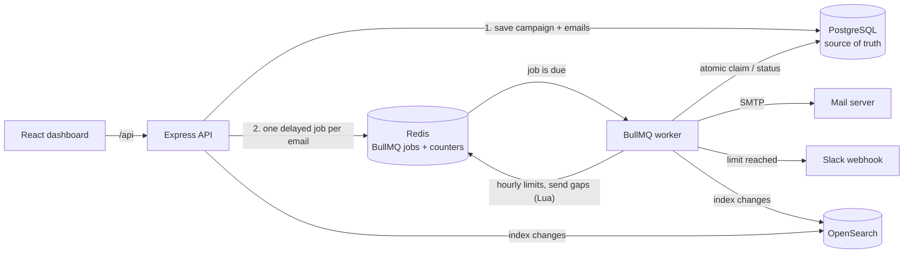

# MailPilot – Fault-Tolerant Email Campaign Scheduler

MailPilot lets you schedule cold-email campaigns. You log in with Google, upload a list of leads, write the email and pick when it should start, how far apart the emails should be and how many can go out per hour. Each email is saved in PostgreSQL and gets its own BullMQ delayed job in Redis, so there's no cron job polling the database. A separate worker process sends the emails over SMTP when they're due, keeps every sender and campaign under its hourly limit, and pushes extra emails into later hours instead of dropping them. If a limit is hit you get a Slack message. You can kill the worker in the middle of a big campaign and restart it, and every email still goes out exactly once.

Live demo: [LIVE_DEMO_URL]

(The backend is on a free hosting plan, so if nobody has used it for a while the first request can take a minute or two.)

Built with TypeScript, Express 5, BullMQ, Redis, PostgreSQL (Prisma), OpenSearch, React 19, Tailwind CSS and TanStack Query.

## Features

- Create a campaign: upload leads from a CSV/TXT file (duplicates are removed), write the body in a rich-text editor, add attachments, and set a start time, a delay between emails and an hourly limit
- Every email is a BullMQ delayed job, with no cron and no polling
- Restarts and crashes don't lose or duplicate emails (startup reconciler + atomic claim in the database)
- Hourly limits per sender and per campaign, kept in Redis so they hold across any number of workers
- A minimum gap between two sends from the same sender
- Emails over the limit are moved to later hours in their original order
- Slack alerts through a real OAuth install, one per sender/campaign per hour
- Full-text search on OpenSearch, with a Postgres fallback
- Google login with an httpOnly session cookie
- Bull Board at `/api/admin/queues` to watch the queue live
- Scheduled and Sent tabs, email detail page, starring, filters, and a layout that works on mobile

## Tech stack

| Layer | What I used |
|---|---|
| Frontend | React 19, Vite, TypeScript, Tailwind CSS 4, TanStack Query, React Router, TipTap |
| Backend | Node.js, TypeScript, Express 5, BullMQ, Zod, Nodemailer, Pino, Helmet, Vitest |
| Data | PostgreSQL + Prisma 7, Redis, OpenSearch |
| Infra | Docker Compose for local services, Render (API + worker), Vercel (frontend), Google OAuth, Slack OAuth, Ethereal SMTP for testing, Bull Board |

## How it works



### Scheduling

When a campaign is created (`POST /api/campaigns`), the API validates the input, removes duplicate recipients, sanitizes the HTML and works out a send time for every email in advance ([schedulePlanner.ts](backend/src/services/schedulePlanner.ts)). Emails are spaced by the campaign's delay, and no clock hour gets more emails than the campaign's hourly limit. The campaign and its emails are written in one transaction. After that, each email gets a BullMQ job with `delay = scheduledAt - now`, and the job id is the email id. That's all the scheduling there is. No cron, polling loop or `setInterval` is involved.

### Postgres is the source of truth

Every email row has its status (`SCHEDULED → SENDING → SENT / FAILED`), its scheduled time, and how many attempts and deferrals it has had. Redis only holds the timers and the rate-limit counters. The OpenSearch index can always be rebuilt from Postgres.

### Surviving restarts

This was the part I cared about most.

- When a worker starts, the [reconciler](backend/src/queue/reconciler.ts) looks for every email that is still `SCHEDULED`, or stuck in `SENDING` with an old lock, and queues it again. BullMQ ignores a job whose id already exists, so this can run as many times as you like. Overdue emails go out right away and future ones keep their time. This covers a crash between saving to the DB and adding the job, a worker dying mid-send, and even Redis being wiped.
- Before sending, the [worker](backend/src/workers/emailWorker.ts) claims the email with a single conditional `UPDATE` (`SCHEDULED → SENDING`). Only one worker can win that update, and a `SENT` or `FAILED` row never matches it. If a claim is more than 2 minutes old, the worker that made it is assumed dead and another one can take over.
- To avoid scheduling the same email twice: duplicate job ids are ignored, the DB has a unique `(campaignId, recipient)` constraint, and the compose form sends an idempotency key, so double-clicking Send still creates one campaign.
- If SMTP fails, BullMQ retries the job up to 3 times with exponential backoff starting at 30s. After that the email is marked `FAILED` with the error message.

### Rate limits across workers

The hourly counters are Redis keys per sender (or campaign) per UTC hour, like `rl:sender:{id}:2026100214`. A Lua script checks the sender limit and the campaign limit together and only increments both if there's room in both. Because it runs atomically, several workers can run side by side without going over ([rateLimiter.ts](backend/src/services/rateLimiter.ts)). A second Lua script keeps a "next free send time" per sender, using the Redis clock, which is how the minimum gap between sends (`MIN_DELAY_BETWEEN_SENDS_MS`) holds across processes.

### When the limit is hit

The email goes back to `SCHEDULED` with a later time, and its job is moved to that time. Rather than pushing every extra email into the next hour (where most of them would hit the limit again), the overflow is spread over as many hours as it needs, in the original order. Before touching the database, the worker checks the Redis counters, so a big overflow costs just one DB write per email.

### Slack alerts

Each user connects their own Slack workspace through OAuth v2 (`incoming-webhook` scope), and the webhook URL is saved for that user. When a limit is hit, a Redis `SET NX` key makes sure the user gets one alert per limit per hour, no matter how many emails or workers run into it. The Slack connection is read at the moment the alert is sent, so it starts working as soon as you connect, without a restart. If Slack isn't connected, the alert is skipped.

### Search

Changes to emails are collected and written to OpenSearch in bulk. Each document carries the row's `updatedAt` as its version, so an old update can't overwrite a newer one. Recipient and subject use `search_as_you_type`, so results show up while you type. If no search cluster is configured, search falls back to a Postgres query. `npm run search:reindex` rebuilds the index from the database.

### Auth and monitoring

Login uses Google OAuth: the backend verifies the ID token with `google-auth-library`, then sets a signed JWT in an httpOnly cookie. Bull Board at `/api/admin/queues` shows waiting, delayed, active, completed and failed jobs.

## Reliability testing

Unit tests (`npm test`, Vitest) cover the send-time planner (delays, hourly windows, and 1,000 emails never exceeding the limit in any hour), how overflow gets spread across later hours, the Redis hour keys, and the per-sender mutex.

For load testing I wrote [loadTest.ts](backend/src/scripts/loadTest.ts). It schedules N emails at the same moment through the real API, shows progress while they send, and then checks the database:

| Check | How |
|---|---|
| Nothing dropped | every row is SCHEDULED, SENDING, SENT or FAILED |
| No duplicates | number of SENT rows equals number of distinct Message-IDs |
| Hourly limit held | busiest sender-hour is at or below that sender's limit |
| Send gap held | smallest gap between sends per sender is at least `MIN_DELAY_BETWEEN_SENDS_MS` |
| No failures | zero FAILED rows |

My main test was 1,000 emails across 3 senders, with the limit dropped to 10 per hour per sender. Partway through, I hard-killed the worker and started it again. The reconciler picked up all the pending emails, and every check passed: no duplicates across the crash, no sender over 10 in an hour, at least 2s between sends. Slack got one alert per sender, not hundreds. The script doesn't kill the worker for you, so to try it yourself:

```bash
MAX_EMAILS_PER_HOUR_PER_SENDER=10 npm run dev:worker    # terminal 1 (bash)
npm run load-test --workspace backend -- --count 1000   # terminal 2, then kill and restart terminal 1
npm run load-test --workspace backend -- --verify <campaignId>
```

One edge case I couldn't fully close: if the process dies right after the SMTP server accepts an email but before the DB marks it `SENT`, that email can be sent again once its 2-minute lock expires. SMTP has no way to make the send and the DB update one atomic step, so every email has a fixed `Message-ID` that receiving servers can use to drop the duplicate.

## Running it locally

You'll need:
- Node.js 20.19 or newer
- PostgreSQL, Redis and (optionally) OpenSearch. `docker compose up -d` starts all three using the included `docker-compose.yml`.
- A Google OAuth client for login, plus a Slack app if you want alerts (setup steps below)

Install and set up the env file:

```bash
npm install
cp backend/.env.example backend/.env    # defaults match docker-compose, just add your OAuth keys
```

The frontend doesn't need a `.env` (see [frontend/.env.example](frontend/.env.example)).

Set up the database and create some test senders:

```bash
npm run db:deploy --workspace backend
npm run seed:senders --workspace backend
```

The senders are [Ethereal](https://ethereal.email) accounts. Ethereal is a fake SMTP server: it accepts emails but never delivers them, and each one gets a preview link you can open from the dashboard.

Start everything (each in its own terminal):

```bash
npm run dev:api       # API on http://localhost:4000
npm run dev:worker    # worker, a separate process so you can kill/restart it
npm run dev:web       # frontend on http://localhost:5173
```

You can also run `npm run dev` to start all three in one terminal. Then open http://localhost:5173 and sign in with Google.

Tests and builds:

```bash
npm test
npm run typecheck
npm run build
npm start             # built API; npm run start:worker for the worker
```

<details>
<summary>Google OAuth setup</summary>

1. In Google Cloud Console, open Google Auth Platform and set up the consent screen (External).
2. Clients → Create client → Web application
   - JavaScript origin: `http://localhost:5173`
   - Redirect URI: `http://localhost:5173/api/auth/google/callback`
3. Copy the client ID and secret into `GOOGLE_CLIENT_ID` and `GOOGLE_CLIENT_SECRET` in `backend/.env`.
4. While the app is in testing mode, add your Google account under Audience → Test users.
</details>

<details>
<summary>Slack app setup (optional)</summary>

1. Go to https://api.slack.com/apps → Create New App → From a manifest, and paste:
   ```json
   {
     "display_information": { "name": "MailPilot Alerts" },
     "features": { "bot_user": { "display_name": "MailPilot Alerts", "always_online": false } },
     "oauth_config": {
       "redirect_urls": ["http://localhost:5173/api/slack/callback"],
       "scopes": { "bot": ["incoming-webhook"] }
     },
     "settings": { "org_deploy_enabled": false, "socket_mode_enabled": false, "token_rotation_enabled": false }
   }
   ```
2. Copy the client ID and secret from Basic Information → App Credentials into `SLACK_CLIENT_ID` and `SLACK_CLIENT_SECRET`.
3. Connect from the app itself: user menu → Connect Slack.
</details>

## Project structure

```
.
├── backend/
│   ├── prisma/            # schema and migrations
│   └── src/
│       ├── config/        # env validation
│       ├── lib/           # prisma, redis, opensearch, logger, jwt
│       ├── middleware/    # auth, errors
│       ├── queue/         # BullMQ queue + startup reconciler
│       ├── routes/        # auth, campaigns, emails, senders, slack, health, queue dashboard
│       ├── schemas/       # zod request schemas
│       ├── scripts/       # seed senders, reindex search, load test
│       ├── services/      # planner, rate limiter, mailer, campaigns, search, slack
│       ├── workers/       # the email job processor
│       ├── server.ts      # API entry point
│       └── worker.ts      # worker entry point
├── frontend/
│   └── src/
│       ├── api/           # API client
│       ├── components/    # shared UI and layout
│       ├── features/      # auth, compose, emails, slack
│       ├── pages/         # login, mailbox, email detail, compose
│       └── types/         # API types
├── docs/screenshots/
├── docker-compose.yml
└── render.yaml
```

## Screenshots

| Mailbox | Compose |
|---|---|
|  |  |

| Slack alert | Bull Board |
|---|---|
|  |  |

## Why I built this

Cold-email tools have two jobs that sound simple: send each email at the right time, and never let a mailbox go over its hourly limit, because that's how sending accounts get flagged. Both have to keep working when a worker crashes halfway through a campaign. The usual shortcut is a cron job that polls the database every minute. It's imprecise, and it gets messy once more than one worker is involved. I wanted to see if I could do it properly without cron: delayed jobs for timing, Postgres as the source of truth, and atomic Redis counters that every worker shares.

## What I'd add next

- Open and click tracking, with stats per campaign
- Team workspaces with roles (this would also let me restrict Bull Board to admins)
- Prometheus metrics for queue depth, send latency, deferrals and failures, with a Grafana dashboard
- A real email provider like Amazon SES, with bounce and complaint handling, sender warm-up, and attachments in S3 instead of Postgres

## Author

Navneet Singh
- GitHub: [GITHUB_PROFILE_URL]
- LinkedIn: [LINKEDIN_PROFILE_URL]
